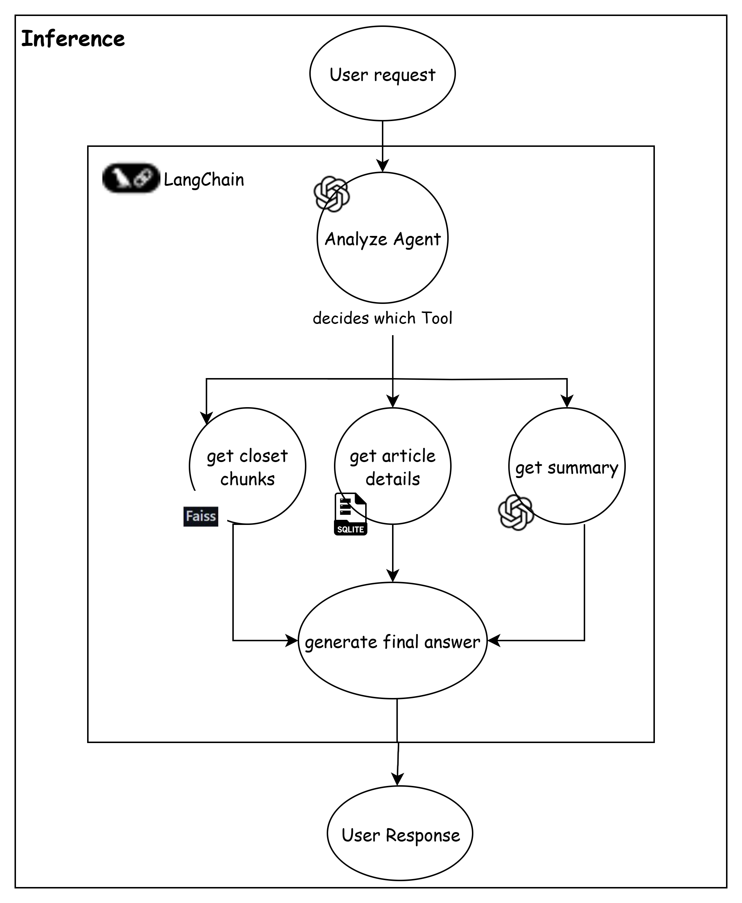

# MS_Inference


This project is an intelligent research assistant for answering questions about articles using both structured SQL search and semantic vector search.

## Setup

### 1. Clone the Repository

```sh
git clone <your-repo-url>
cd MS_Inference
```

### 2. Install Dependencies

It is recommended to use a virtual environment.

```sh
python -m venv venv
source venv/bin/activate  # On Windows: venv\Scripts\activate
pip install -r requirements.txt
```

### 3. Environment Variables

Create a `.env` file in the project root:

```
OPENAI_API_KEY=your-openai-api-key-here
```

### 4. Prepare the Database (`articles.db`)

> **Note:**  
> You do **not** need to manually create or populate the `articles.db` database.  
> Another microservice in your system handles preprocessing and saving articles to the database automatically.  
> Ensure that this microservice is running and has populated the database before proceeding.

### 5. Prepare the FAISS Vector Store (`faiss_articles`)

> **Note:**  
> You do **not** need to manually create or fill the `faiss_articles` vector store.  
> The vector store is created and populated automatically as part of your workflow.  
> Just ensure that the vector store exists and is up-to-date before running this service.

### 6. System Prompt

Ensure `system_prompt.yaml` exists in the project root (already provided).

## Running the Service

### Locally

```sh
python inference.py
```

### With Docker

Build and run the container:

```sh
docker build -t chatproject .
docker run --env-file .env -v $(pwd):/app chatproject
```

## Example Usage

The script will run example queries and print answers to the console.

## Notes

- Make sure your OpenAI API key is valid and has sufficient quota.
- Ensure `articles.db` and `faiss_articles` are present and populated before running the service.
- For production or API usage, consider adding a web server (e.g., FastAPI).

---
